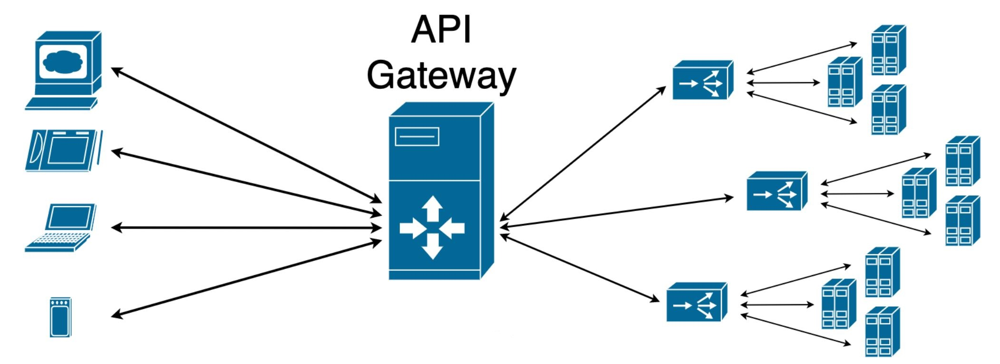

## Spring Cloud Gateway

Running on Server Port 9090

- ##### API Gateway Pattern
	- ###### Gateway Responsibilities
		- Routing / Dynamic Routing
		- Security
		- Rate Limiting
		- Monitoring / Logging
		- Caching

	- ###### Types of Gateways
		- Appliances / Hardware - example: F5
		- SAAS (Software as a Service) - AWS Elastic Load Balancer
		- Web Servers - Configured as Proxies
		- Developer Oriented - Zuul (Netflix) or Spring Cloud Gateway
		- Others - not an exhaustive list, technology is evolving & overlapping
		- Types are often combined

- #### Developer Oriented Gateways
	- ###### Zuul (Netflix) - Zuul is the 'gatekeeper' in the movie Ghostbusters
		- Netflix announced in June 2013 it was opensourcing Zuul
			- "Edge Service in the Cloud"
			- 1,000 different client types
			- 50,000+ requests per second
			- Reminder - at times in the past, during evening when everyone is home, Netflix traffic has been estimated to up to 1/3 of all US network traffic

	- ###### Problems with Zuul 1
		- Used Java's HTTP Servlet API
			- Blocking - inefficient
			- Did not support HTTP 2
		- September 2016 Netflix moved to Zuul 2
			- Non-Blocking - much more efficient
			- Support for HTTP 2
			- Announced they planned to open source Zuul 2

- ##### Spring Cloud Gateway
    - In 2017, Spring Cloud team decided to not migrate Spring Cloud to Zuul 2
    - Direction of Zuul 2 was unclear at the time
    - While Netflix open sourced Zuul 1, some components were still closed source
    - Also when Spring 5 had recently gone GA (General Availability), which included reactive support
    - First milestone release in August 2017
    - 1.0 GA Release in Novemeber 2017
      
- ###### Spring Cloud Gateway Features
    - Java 8+, Spring Framework 5, Spring Boot 2, Project Reactor
    - Non-blocking, HTTP 2 Support, Netty
    - Dynamic Routing
    - Route Mapping on HTTP Request attributes
    - Filters for HTTP Request and Response

- Depending on your architecture, you may not even use a Gateway. You might be deploying on AWS using Elastic Load Balancers, so the Gateway component might not even be in your architecture.
- ###### But in a Spring Cloud Context, you are NOT locked into a specific vendor.
    - can deploy Spring Cloud Gateway literally on some generic Linux servers and have full functionality
    - Not tied to Docker, Google Cloud, AWS, Kubernetes, Docker Swarm, Windows, Linux, etc. - totally agnostic
    